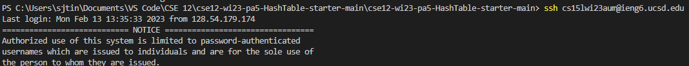
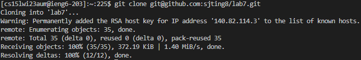
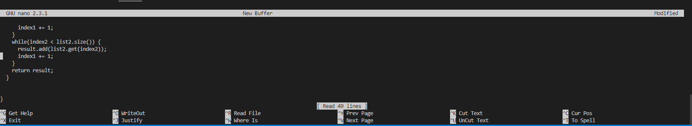
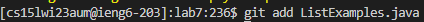

# **Lab Report 4**
By: Sean Ting

## Step 1
Log into ieng6

ssh command is used to log into a remote server (ieng6)

## Step 2
Clone your fork of the repository from your Github account

clones the git url into repository

## Step 3
Run the tests, demonstrating that they fail

*cd into lab7*

Compile and run Junit Tests

Keys pressed: `<up><up><up><up><up><enter>, <up><up><up><up><up><enter>`

The javac -cp .:lib/hamcrest-core-1.3.jar:lib/junit-4.13.2.jar *.java command was 5 commands up in the search history, so I used up arrow to access it and enter to reinput it. Then the java -cp .:lib/hamcrest-core-1.3.jar:lib/junit-4.13.2.jar org.junit.runner.JUnitCore command was 5 up in the history, so I accessed and ran it in the same way.
  
The first javac command compiles files with junit and the second java command runs the junit tests.
  
## Step 4
Edit the code file to fix the failing test

*Enter nano command (nano `<enter>`)*

This opens up the nano window
  
`<Ctrl-R ListExamples.java>`

This reads the ListExamples.java file.

Use arrow keys to find in the code and change the first occurrence of index1+=1; (the most bottom one) to index2+=1;
  
`<Ctrl-O ListExamples.java>` and then `<y>` to overwrite. This replaces the old file with the new edited one.
  
`<Ctrl-X>`

To exit nano.
 
## Step 5
Run the tests, demonstrating that they now succeed

Keys Pressed: `<up><up><enter>`

Accesses and runs the JUnit test command.

Should now show that all the test pasts.

## Step 6
Commit and push the resulting change to your Github account (you can pick any commit message!)

