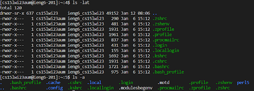

# **Lab Report 1**
By: Sean Ting

Welcome to 15L! This is a tutorial on how to set up your course-specific account.

## Installing VSCode
* The first thing you want to do is to set up Visual Studio Code or VScode.
* Go to the *[Visual Studio Code Website](https://code.visualstudio.com/)* and then follow the steps to download and install it on your computer.
* After it is installed, opening it should open a window that looks like this:

## Remotely Connecting

Now you are ready to remotely connect.

* Open a terminal in VS code and type the following: **ssh cs15lwi23zz@ieng6.ucsd.edu** with the zz replaced by the letters in your course-specific account.
* It will then ask if you want to continue connecting. Enter yes.
* It will then ask for your password. Enter your password. ***Note that the characters you type will not show up on your screen.***
* Your terminal should look something like this:

Now your terminal is connected to a computer in the CSE basement, and any commands you run will run on that computer! We call your computer the client and the computer in the basement the server based on how you are connected.

## Trying Some Commands

You are now ready to run some commands.

* Try running different terminal commands like cd, ls, pwd, mkdir, and cp a few times in different ways, both on your computer, and on the remote computer after ssh-ing using the terminal in VScode.
* The cd command takes you into a folder or directory you input in the argument after.
* The ls command lists all the files in the directory.
* The pwd command writes the full path name of your current directory starting from the root directory.
* The mkdir command allows you to make directories from the terminal.
* The cp command is used to make a copy of a file.
* *To log out of the remote server in your terminal, you can enter exit.*
* Your terminal may look something like this:

Congradulations! You have set up your course-specific account.
