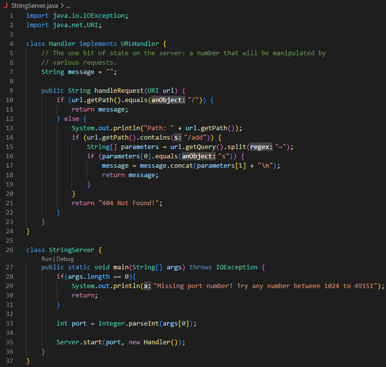
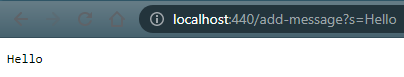

# **Lab Report 1**
By: Sean Ting

## Part 1
StringServer.java:

**/add-message?s=Hello as path:**

* When the above is put into the URL, the handleRequest method is called, with the URL as the parameter.
* Since the path is not equal to "/", the else statement is executed.
* 

**Reload with /add-message?s=How are you as path:**

* When the above is put into the URL, the handleRequest method is called, with the URL as the parameter.
