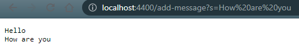

# **Lab Report 1**
By: Sean Ting

## Part 1
StringServer.java:


**/add-message?s=Hello as path:**


* When the above is put into the URL, the handleRequest method is called, with the URL as the parameter.
* Since the path is not equal to "/", the else statement is executed.
* The code will print the path in the terminal that runs the server and since the path contains "/add", the code will execute the if statement.
* The query is split at "=" so the "s" is taken in for the first element of the parameters String array and the message after the equal sign is taken in as the second element.
* Since "s" is the first element of the parameters array, the String variable, message, will concatenate with the second parameter, or the message, and start a new line (*\n*).
* It will then return the message variable which would now be "Hello\n" and "Hello" would appear on the website.

**Reload with /add-message?s=How are you as path:**



* When the above is put into the URL, the handleRequest method is called, with the URL as the parameter.
* Since the path is not equal to "/", the else statement is executed.
* The code will print the path in the terminal that runs the server and since the path contains "/add", the code will execute the if statement.
* The query is split at "=" so the "s" is taken in for the first element of the parameters String array and the message after the equal sign is taken in as the second element.
* Since "s" is the first element of the parameters array, the String variable, message, will concatenate with the second parameter, or the message, and start a new line (*\n*).
* It will then return the message variable which would now be "Hello\nHow are you\n" and "Hello" would appear on the first line and "How are you" would appear on the second line.

## Part 2

**The original code:**

```
  static void reverseInPlace(int[] arr) {
    for(int i = 0; i < arr.length; i += 1) {
      arr[i] = arr[arr.length - i - 1];
    }
  }
```

**Failure-inducing input for buggy program:**

```
public void testReverseInPlace() {
    int[] input1 = { 5, 0, -1, 4 };
    ArrayExamples.reverseInPlace(input1);
    assertArrayEquals(new int[]{ 4, -1, 0, 5 }, input1);
}
```

**Symptom:**


The input1 array will be {4, -1, -1, 4} after the reverseInPlace method is called because the code replaces the values at the front of the array without storing them, so after the code iterates past the midpoint, it will replace the items with the value that is already in them. *Ex. after the first iteration it would be {4, 0, -1, 4} and the last iteration would replace 4 with 4.*


**Input that does not fail:**

```
public void testReverseInPlace() {
    int[] input1 = { 3 };
    ArrayExamples.reverseInPlace(input1);
    assertArrayEquals(new int[]{ 3 }, input1);
}
```

This input does not fail because since there is only one value in the array, it replaces itself with itself and the final array is equivalent because it's the same one value.

**Symptom:**


**Bug Fix:**

Before:

```
   for(int i = 0; i < arr.length; i += 1) {
      arr[i] = arr[arr.length - i - 1];
   }
```

After:

```
    int temp;
    for(int i = 0; i < (arr.length/2); i += 1) {
      temp = arr[i];
      arr[i] = arr[arr.length - i - 1];
      arr[arr.length - i - 1] = temp;
    }
```

This fixes the issue because it swaps the values (replaces both values) in each iteration and only goes through the loop arr.length/2 times. This is because the second half of the array doesn't need to be iterated through since it was already swapped when going through the first half. Integer division rounds down, so when the array length is odd, it stops before the mdidle value which wouldn't matter because it would swap with itself anyways. The integer variable temp is used to store the value from the first half, so when it gets replaced by the later value, the item in the second half of the array can get replaced with its counterpart's original value.


## Part 3

Something I learned from lab in the past two weeks that I didn't know before was how to use the URL query to store and manipulate variables and return back to the user. When learning about this, I thought that it was very interesting because there is so much that you can do with it.
